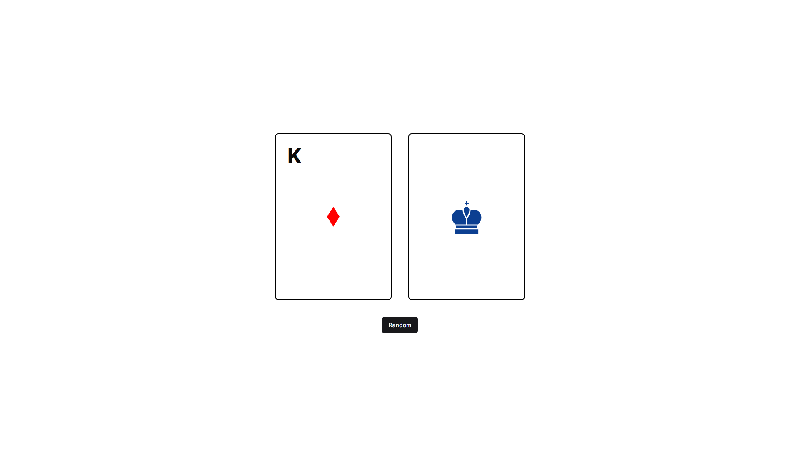

# ♟ Welcome to Card Chess

⭐ Get random playing card  
🎩 Generate it's equivalent chess piece  
🔳 In a single click ❗ 

### 📌 Chess Piece Conversion
| Card Face |  Chess Piece |
|:---------:|:------------:|
| King      | ♔            |
| Queen     | ♕            |
| Jack      | ♗            |
| Ace       | ♖            |
| 10        | ♘            |
| 2-9       | ♙            |

### ❓ What about ♙
If you get a numbered card, equivalent chess piece would be pawn. But which pawn ??
| Number (on Card) | Row (for Pawn) |
|:------:|:---:|
| 2      | A   |
| 3      | B   |
| 4      | C   |
| 5      | D   |
| 6      | E   |
| 7      | F   |
| 8      | G   |
| 9      | H   |
